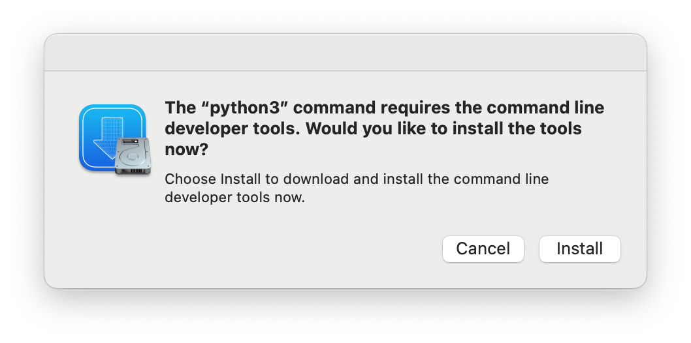

# Setup macOS with Ansible

## Playbooks

In the main playbook file [playbook.yml](playbook.yml),
there are several playbooks imported.
Each of them will be executed sequentially.

Playbooks referenced by the main playbook are in the `playbooks` folder.
For different usages of the target macOS,
you may need to customize these playbooks,
or disable some of them from the main playbook.

### Install Homebrew

The playbook [install-homebrew.yml](playbooks/install-homebrew.yml)
ensures [homebrew](https://brew.sh/) is present on the target machine.

The present of the homebrew is mandatory to installing applications and development tools.
If you don't want to install homebrew,
change the variable `install_homebrew_when_missing` in `vars` section to `false`.

### Update Homebrew

The playbook [update-homebrew-packages.yml](playbooks/update-homebrew-packages.yml)
ensures homebrew and homebrew managed packages are up-to-date.

### Install Applications

The playbook [install-apps.yml](playbooks/install-apps.yml)
ensures some applications are installed on the target machine.

Applications will be installed are listed under the
`vars.brew_cask_packages` section.
For any more applications needed,
search on [homebrew web](https://brew.sh/) for the application id
and add it to the application list.

### Install Development Tools

The playbook [install-dev-tools.yml](playbooks/install-dev-tools.yml)
ensures development tools are installed on the target machine.

For usages of the target machine other than software development,
this playbook could be disabled.

Applications will be installed are listed under the
`vars.brew_cask_packages` and `vars.brew_packages` section.
For any more applications needed,
search on [homebrew web](https://brew.sh/) for the application id
and add it to the list.

### Setup macOS

The playbook [setup-macos.yml](playbooks/setup-macos.yml)
maintains some system preferences with the `defaults` command.
`defaults` is a command line utility that manipulates plist files.

> Warning:
> This section will customize the system to **my own** preference.
> Customize it carefully how you prefer.

## Install Ansible

Ansible has to be installed on the managing machine,
on which ansible playbooks will be executed.
When setting up a remote machine,
the target machine doesn't have to install ansible.

Following the next steps to [install ansible](https://docs.ansible.com/ansible/latest/installation_guide/index.html),

1. Upgrade Pip: `sudo pip3 install --upgrade pip`
2. Install Ansible: `pip3 install ansible`

## Preparation For Remote Machine Setup

> This section only apples when you want to set up a remote macOS machine.

You can set up a remote macOS machine from the current working device, like
a laptop on the same desk,
or an [EC2 Mac instance](https://aws.amazon.com/ec2/instance-types/mac/).
To manage a remote machine,
remote login via SSH has to be enabled from the target machine.

1. Go to **System Preference** => **General** => **Sharing**
2. In **Advanced** section, enable **Remote Login**

Then create a new host in the `inventory.yml` file
with the IP address and hostname,
and add it to the `target` group.

> You can also replace `inventory.yml` with your own inventory if needed.
> Please note the group name `target` in the inventory file matters.

The inventory file after changing could be like:

```yaml
# filename: inventory.yml
---
mbp_group:
  hosts:
    my_new_amazing_macbook_pro:
      ansible_host: 192.168.0.3
      ansible_user: elisa
      host_key_checking: false
target:
  children:
    mbp_group:
```

## Set Up MacOS

### Execute The Setup

1. Run the following command from the current folder to start the setup.

   ```shell
   ansible-playbook playbook.yml --ask-pass --ask-become-pass
   ```

2. It will promote for two passwords:
    - the user login via SSH password (if setting up remotely)
    - the user's sudo password

   Enter the password of the macOS user to continue.

3. For the first time setting up a new macOS machine,
   it might promote **on the target machine** with the following pop-up
   for installing [Xcode Command Line Tools](https://developer.apple.com/xcode/resources/).
   And the script will fail with an error message. No worries.
   Choose **Install** to continue.
   After the installation, you have to restart from the step 1.

   

4. Take a cup of tee and wait.
   The script will finish its work and quit itself.

## Still Need Some Manual Work

### oh-my-zsh

I didn't find a proper way to install `oh-my-zsh` gracefully with ansible.
Follow [their webpage](https://ohmyz.sh/#install) to install.
The command could be:

```shell
sh -c "$(curl -fsSL https://raw.githubusercontent.com/ohmyzsh/ohmyzsh/master/tools/install.sh)"
```

### JEnv Plugins Setup

To use JEnv to manage JDK version for gradle/maven runtimes,
the corresponding plugins need to be enabled
with the following commands.

```shell
jenv enable-plugin maven
jenv enable-plugin gradle
```

Ansible will fail for them as we usually don't setup `jenv` for `/bin/sh`.

## References

- https://gist.github.com/mrlesmithjr/f3c15fdd53020a71f55c2032b8be2eda
- https://mac.getutm.app/
